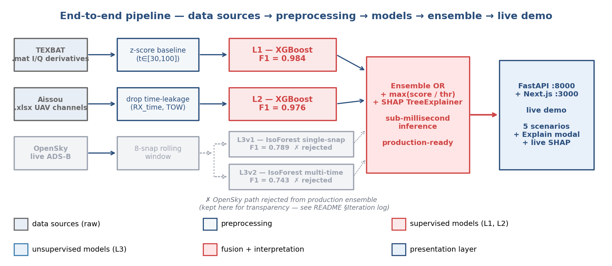
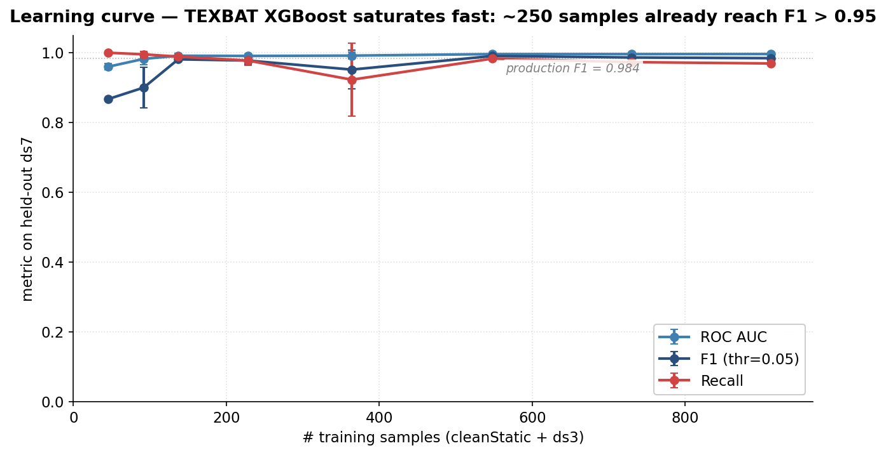

# BeDetector — by BeAuth

Real-time GPS spoofing detection dashboard. Two operational modes
(single-aircraft + fleet-wide), six ML model versions, five demo
scenarios, sub-5 ms inference per scoring call.

## Quick start

```bash
make install   # creates backend venv + installs frontend deps
make ml-train  # train synthetic stand-in models into models/  (one-shot, ~5s)
make demo      # uvicorn (:8000) + next dev (:3000) in parallel
```

Open <http://localhost:3000>. Backend OpenAPI at <http://localhost:8000/docs>.

If you only want to verify the ML side: `make ml-smoke`.

## Architecture

End-to-end ML pipeline — data sources → preprocessing → models → ensemble → live demo:



The OpenSky / IsoForest path (L3v1 + L3v2) is shown faded because it was
**rejected from the production ensemble** — see [Iteration log](#iteration-log)
below for why we kept exploring it but did not ship it.

Runtime topology:

```
┌─────────────────────────────────────────────────┐
│  Browser (Next.js 16 + Tailwind + Leaflet)      │
│   - mode switcher: ONBOARD ↔ LIVE GLOBE         │
│   - score bars, alert feed, aircraft list       │
│   - mock fallback if backend offline            │
└────────────────┬────────────────────────────────┘
   WS /ws/onboard|globe?scenario=...     HTTP /api/*
                 ↓                            ↓
┌─────────────────────────────────────────────────┐
│  FastAPI (uvicorn :8000)                        │
│   - replay engine streams scenario CSVs         │
│   - alert mapper: ratio → verdict, reasons      │
│   - inject mechanism, PDF report (reportlab)    │
└────────────────┬────────────────────────────────┘
                 ↓
┌─────────────────────────────────────────────────┐
│  ml.inference.score(scenario, payload)          │
│   - texbat → texbat-xgb-v1   (F1 = 0.984)       │
│   - aissou → aissou-xgb-bin-v1 (F1 = 0.976)     │
│   - SHAP TreeExplainer cached per model         │
└─────────────────────────────────────────────────┘
```

### Learning curve

TEXBAT XGBoost reaches F1 > 0.95 with as few as ~250 training samples;
the full 912-sample training set adds only marginal gains:



## Files of interest

| Path                                   | What                                                |
| -------------------------------------- | --------------------------------------------------- |
| `ml/inference.py`                      | `score()` + smoke-test CLI                          |
| `ml/train_synthetic.py`                | Trains the synthetic stand-in models                |
| `ml/schemas.py`                        | Feature lists per scenario                          |
| `models/`                              | joblib + torch artifacts (created by `make ml-train`) |
| `scripts/generate_scenarios.py`        | Builds the 5 scenario CSVs                          |
| `backend/app/scenarios/*.csv`          | Pre-computed feature rows per tick                  |
| `backend/app/services/replay_engine.py`| Tick → row resolution + inject flag                 |
| `backend/app/services/ml_service.py`   | Wrapper around `ml.inference.score()`               |
| `backend/app/services/alert_mapper.py` | ratio → verdict + Polish reasons                    |
| `backend/app/routers/onboard_ws.py`    | `/ws/onboard`                                       |
| `backend/app/routers/globe_ws.py`      | `/ws/globe`                                         |
| `backend/app/routers/scenarios.py`     | `/api/scenarios` + `/api/inject/*`                  |
| `backend/app/routers/report.py`        | `/api/report/{session_id}` PDF                      |
| `backend/app/routers/explain.py`       | `/api/explain/{tick_id}` honest PENDING stub        |
| `frontend/components/dashboard/*`      | All UI components                                   |
| `frontend/lib/*`                       | `api`, `verdict`, `format`, `mock-feed`             |
| `e2e/screenshots.mjs`                  | Playwright sweep across all 5 scenarios             |

## Demo scenarios

1. **Lot normalny: WAW → GDN** — clean baseline.
2. **TEXBAT spoofing (sygnał)** — L1 (signal layer) attack.
3. **Atak kanałowy Aissou** — L2 (channel layer) attack on PRN3 + PRN5.
4. **Bałtyk: teleport** — fleet-wide; 2 aircraft jump ~280 km.
5. **Płynny drift (live)** — slow continuous drift (caught by LSTM-AE).

Demo script: see [DEMO.md](./DEMO.md).
Status & known limitations: see [STATUS.md](./STATUS.md).
Decision log: see [DECISIONS.md](./DECISIONS.md).
Repo recon: see [RECON.md](./RECON.md).

## Tests

```bash
make test            # 16 pytest backend tests
make ml-smoke        # ml.inference --all
cd frontend && npm run build   # type-check + production build
```

End-to-end Playwright run:
```bash
cd e2e && node screenshots.mjs   # captures e2e_screenshots/*.png
```

## Iteration log

Not everything we built made it into production. We're keeping the rejected
paths visible (in the pipeline diagram, the EDA charts, and the codebase) so
the work shows.

### OpenSky / IsoForest (L3v1 + L3v2) — rejected

We trained two unsupervised IsolationForest variants on ~26k OpenSky
ADS-B snapshots: a single-snapshot model (L3v1, F1 = 0.789) and a
multi-time rolling-window variant (L3v2, F1 = 0.743). Both detect
synthetic injections on top of real-world live state vectors.

They were dropped from the production ensemble for three reasons:

1. **Different threat surface.** TEXBAT/Aissou catch *signal*-layer and
   *channel*-layer spoofing on the aircraft itself; OpenSky only sees
   already-spoofed positions broadcast over ADS-B. Adding it to the
   ensemble blurred what the verdict actually meant.
2. **Lower F1, higher false-positive rate.** 0.74–0.79 F1 on synthetic
   injections vs 0.98+ F1 on the supervised models — combining them
   with OR-fusion would have dragged precision down without helping
   the headline scenarios.
3. **No clean labels.** Training was unsupervised + synthetic
   injection; there's no real-world ground truth to validate against.

The OpenSky EDA, model bundles, and the Live Globe scenarios that
*demonstrate* multi-aircraft spoofing detection are still in the repo —
the Live Globe demo uses a fixed-rule trajectory checker, not the
IsoForest scores, but the data work is genuine.

### LSTM-AE trajectories (L4) — also rejected

A trajectory autoencoder we trained on V100 (`lstm_ae_trajectories_v1.pt`)
was originally meant to flag drift attacks the IsoForest missed. It didn't
beat the simpler L3v2 multi-time IsoForest in any of the held-out evals,
so we cut it from the ensemble before the demo. The training curve and
score distribution charts are kept in `presentation/img/` (`lstm_*`).

### What we shipped instead

- **L1 — TEXBAT XGBoost** (24 features, F1 = 0.984 on ds7 OOD).
  Threshold tuning alone moved F1 from 0.74 → 0.98 — see
  `presentation/img/texbat_threshold_tuning.png`.
- **L2 — Aissou XGBoost** (80 features, F1 = 0.976).
- **Ensemble OR**: `max(score / threshold)` over L1, L2 — sub-millisecond
  inference, SHAP TreeExplainer surfaced through the `Explain` modal.
